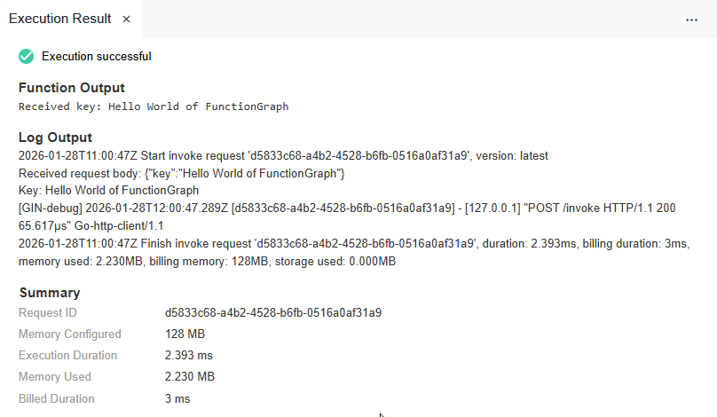

.. _creating_an_event_function_using_a_container_image_built_with_go:

Creating an Event Function Using a Container Image Built with Go
================================================================

For general details about how to use a container image
to create and execute an event function,
see :otc_fg_umn:`Creating an Event Function Using a Container Image <getting_started/creating_an_event_function_using_a_container_image_and_executing_the_function.html#functiongraph-04-0104>`
and executing the Function.

This chapter introduces how to create an image using the Go language and perform local verification.

.. note::

  You need to implement an **HTTP server** in the image listening to port **8000** to receive requests.

  Following request path is required:

  * **POST /invoke** is the function **execution** entry where trigger events are processed.

  To initialize the function configuration, implement the **"init()"** function, which Go will execute automatically.

.. note::
    FunctionGraph currently does not support initializer functions for event functions.

Complete code can be found on Github: :github_repo_master:`Container Event Sample <samples-doc/container-event>`

Step 1: Create the Project
--------------------------------------------

In this example we use the `gin` framework to create an HTTP server.

For details about gin framework, see:

- `Building Web Applications with Gin <https://gin-gonic.com/>`_ or
- `Tutorial: Developing a RESTful API with Go and Gin <https://go.dev/doc/tutorial/web-service-gin>`_

Create Go Module
^^^^^^^^^^^^^^^^^^^^^^^^^^^^^^^^^^^^^^^^^^^^^^^^

**1. Create directories for your project and navigate to it**

.. code-block:: shell

   # cretate project directory and src subdirectory
   mkdir -p container-event/src
   # navigate to project directory
   cd container-event

**2. Initialize a Go module**

Run the following command to initialize a new Go module:

.. code-block:: shell

  go mod init container-event

**3. Add dependencies**

Run the following commands to add the necessary dependencies:

.. code-block:: shell

    # add gin framework
    go get -u github.com/gin-gonic/gin

    # add otc-functiongraph-go-runtime package for use with FunctionGraph events
    go get -u github.com/opentelekomcloud-community/otc-functiongraph-go-runtime

**4. Resulting go.mod**

The resulting **go.mod** file should look like this:

.. literalinclude:: /../../samples-doc/container-event/go.mod
  :language: go
  :caption: :github_repo_master:`go.mod <samples-doc/container-event/go.mod>`
  :tab-width: 2

Implement the function
^^^^^^^^^^^^^^^^^^^^^^^^^^^^^^^^^^^^^^^^^^^^^^^^

Change folder to **src** folder:

.. code-block:: shell

   # navigate to src directory
   cd src

The FunctionGraph program implements an HTTP server to process **init** and **invoke**
requests and give a response.

* Create a **eventhandler.go** file,
* import the **gin** dependency package,
* implement a function named **init()** to initialize the configuration.

  Go runs this function named **init** automatically before any other part of the package.

* implement a function handler (method **POST** and path **/invoke**).

Following example code shows the implementation of HTTP Server in file **eventhandler.go**:

.. literalinclude:: /../../samples-doc/container-event/src/eventhandler.go
   :language: go
   :caption: src/eventhandler.go
   :tab-width: 2

The logic to process the event is implemented in the function **invokeSampleData** in **invokeSampleData.go**.

.. literalinclude:: /../../samples-doc/container-event/src/invokeSampleData.go
   :language: go
   :caption: src/invokeSampleData.go
   :tab-width: 2

To test the function from source code, execute in the **container-event** folder:

.. code-block:: shell

   go run src/eventhandler.go

Create a Makefile
^^^^^^^^^^^^^^^^^^^^^^^^^^^^^^^^^^^^^^^^^^^^^^^^

To simplify the development and testing process,
create a **Makefile** in the **container-event** folder:

.. literalinclude:: /../../samples-doc/container-event/Makefile
   :language: make
   :caption: Makefile
   :tab-width: 2

Build the program
^^^^^^^^^^^^^^^^^^^^^^^^^^^^^^^^^^^^^^^^^^^^^^^^

Build the program either using **go build** or the Makefile target **build**:

.. tabs::

  .. tab:: using go build
       Run the following command in the **container-event** folder to build the program:

       .. code-block:: shell

          # create output folder (if not already existing)
          mkdir -p target

          # build the program
          GOARCH=amd64 GOOS=linux CGO_ENABLED=0 && cd src && go build -o ../target/eventhandler .

  .. tab:: using Makefile target "build"

       Run the following command in the **container-event** folder to build the program:

       .. code-block:: shell

          make build

Run and Test program locally
^^^^^^^^^^^^^^^^^^^^^^^^^^^^^^^^^^^^^^^^^^^^^^^^

**1. Run the program locally**

Run the program locally either using **executable** or the Makefile target **run_local**:

.. tabs::

  .. tab:: using executable
       Run the following command in the **container-event** folder to run the compiled program:

       .. code-block:: shell

          ./target/eventhandler

  .. tab:: using Makefile target "run_local"

        Run the following command in the **container-event** folder to run the program:

        .. code-block:: shell

            make run_local

In the terminal, you should see output similar to the following:

.. code-block:: shell

    cd target && ./eventhandler
    init in main.go
    [GIN-debug] [WARNING] Creating an Engine instance with the Logger and Recovery middleware already attached.

    [GIN-debug] [WARNING] Running in "debug" mode. Switch to "release" mode in production.
    - using env:   export GIN_MODE=release
    - using code:  gin.SetMode(gin.ReleaseMode)

    [GIN-debug] POST   /invoke                   --> main.invoke (4 handlers)
    [GIN-debug] [WARNING] You trusted all proxies, this is NOT safe. We recommend you to set a value.
    Please check https://github.com/gin-gonic/gin/blob/master/docs/doc.md#dont-trust-all-proxies for details.
    [GIN-debug] Listening and serving HTTP on :8000

**2. Test the program locally**

Test the program locally either using **curl** or the Makefile target **test_local**:

.. tabs::

  .. tab:: using curl
       Run the following command in a new terminal
       to test the program using a curl command:

       .. code-block:: shell

          curl -X POST -H 'Content-Type: application/json' -d '{"key":"Hello World of FunctionGraph"}' localhost:8000/invoke

  .. tab:: using Makefile target "test_local"
       Run the following command in a new terminal
       to test the program using the Makefile target "test_local":

       .. code-block:: shell

          make test_local

You should see output similar to the following:

.. code-block:: shell

    curl -X POST -H 'Content-Type: application/json' -d '{"key":"Hello World of FunctionGraph"}' localhost:8000/invoke
    Received key: Hello World of FunctionGraph

Step 2: Build the Container Image
--------------------------------------------

Create a Dockerfile
^^^^^^^^^^^^^^^^^^^^^^^^^^^^^^^^^^^^^^^^^^^^^^^^

Create a **Dockerfile** in the **container-event** folder to define the image.

.. note::

   * | In the cloud environment, **UID 1003** and **GID 1003** are used to start the container by default.
     | The two IDs can be modified by choosing **Configuration** > **Basic Settings** > **Container Image Override**
     | on the function details page. They cannot be **root** or a **reserved** ID.

   * | If the base image of the **Alpine** version is used, run the **addgroup** and **adduser** commands.

   * You an use any base image that meets your application requirements.

Following are two example Dockerfiles, one using Ubuntu base image
and another using Alpine base image.

.. note::

  * Ubuntu images are larger in size but come with more pre-installed libraries.

  * Alpine images are smaller in size but may require additional libraries
    depending on the application requirements.

.. tabs::

  .. tab:: using Ubuntu base image

      Example Dockerfile using Ubuntu base image:

      .. literalinclude:: /../../samples-doc/container-event/Dockerfile
         :language: docker
         :caption: Dockerfile Ubuntu
         :tab-width: 2

  .. tab:: using Alpine base image

      Example Dockerfile using Alpine base image:

      .. literalinclude:: /../../samples-doc/container-event/Dockerfile.alpine
         :language: docker
         :caption: Dockerfile Alpine
         :tab-width: 2

Build and verify the image locally
^^^^^^^^^^^^^^^^^^^^^^^^^^^^^^^^^^^^^^^^^^^^^^^^

**1. Build the image**

Build the image either using **docker build** or the Makefile target **docker_build**:

.. tabs::

  .. tab:: using docker build
      Run the following command in the **container-event** folder to build the image:

      .. code-block:: shell

          docker buildx build \
             --platform linux/amd64 \
             --build-arg FILE_PATH=target \
             --file Dockerfile \
             --tag custom_container_event_example:latest .

      .. note:: Replace **Dockerfile** with **Dockerfile.alpine** in the above command
          to build the image using the Alpine base image.

  .. tab:: using Makefile target "docker_build"
      Run the following command in the **container-event** folder to build the image:

      .. code-block:: shell

          make docker_build

      .. note:: The Makefile is set to use **Dockerfile** by default.

          To build the image using the Alpine base image,
          modify the **DOCKER_FILE** variable in the Makefile
          to point to **Dockerfile.alpine**.

**2. Run the image locally**

Run the image either using **docker run** or the Makefile target **docker_run_local**:

.. tabs::

  .. tab:: using docker run
      Run the following command in the **container-event** folder to run the image:

      .. code-block:: shell

         docker container run --rm \
           --platform linux/amd64 \
           --publish 8000:8000 \
           --name container_event_example \
           custom_container_event_example:latest

  .. tab:: using Makefile target "docker_run_local"

      Run the following command in the **container-event** folder to run the image:

      .. code-block:: shell

         make docker_run_local

**3. Test the image locally**

Test the image either using **curl** or the Makefile target **test_local**:

.. tabs::

  .. tab:: using curl
      Run the following command in a new terminal
      to test the image using a curl command:

      .. code-block:: shell

         curl -X POST -H 'Content-Type: application/json' -d '{"key":"Hello World of FunctionGraph"}' localhost:8000/invoke

  .. tab:: using Makefile target "test_local"
      Run the following command in a new terminal to test the image:

      .. code-block:: shell

         make test_local

You should see output similar to the following:

.. code-block:: shell

  curl -X POST -H 'Content-Type: application/json' -d '{"key":"Hello World of FunctionGraph"}' localhost:8000/invoke
  *** Received key: Hello World of FunctionGraph ***

Step 3: Upload the Container Image to SWR (SoftWare Repository for Container)
-----------------------------------------------------------------------------

For details on SWR (SoftWare Repository for Container), see `Software Repository for Container User Manual <https://docs.otc.t-systems.com/software-repository-container/umn/>`_.

Prerequisites:
^^^^^^^^^^^^^^^^^^^^^^^^^^^^^^^^^^^^^^^^^^^^^^^^
- SWR instance created.
  For more information, see :otc_fg_umn:`Creating a Software Repository for Container <getting_started/creating_a_software_repository_for_container.html#functiongraph-04-0201>`.
- Credentials for SWR created. 
  For more information, see :otc_fg_umn:`Creating Access Credentials <getting_started/creating_access_credentials.html#functiongraph-04-0202>`.

Upload the image to SWR
^^^^^^^^^^^^^^^^^^^^^^^^^^^^^^^^^^^^^^^^^^^^^^^^

To upload the container image to SWR, following values are needed:

.. list-table::
   :header-rows: 1
   :widths: 20 80

   * - Parameter
     - Description
   * - OTC_SDK_PROJECTNAME
     - | Your project name.
       | To obtain this, see: :api_usage:`Obtaining a Project ID<guidelines/calling_apis/obtaining_required_information.html>` 
         in API usage guide but use the **project name** instead of the project ID.
   * - OTC_SDK_AK
     - Your Access Key
   * - OTC_SWR_LOGIN_KEY
     - | The login key for SWR.
       | For details see: `Obtaining a Long-Term Docker Login Command <https://docs.otc.t-systems.com/software-repository-container/umn/image_management/obtaining_a_long-term_docker_login_command.html>`_
         in the Software Repository for Container user manual.
       |
       | It can be generated using the access key **${OTC_SDK_AK}** and secret key **${OTC_SDK_SK}** as follows:

        .. code-block:: shell

          export OTC_SWR_LOGIN_KEY=$(printf "${OTC_SDK_AK}" | \
                  openssl dgst -binary -sha256 -hmac "${OTC_SDK_SK}" | \
                  od -An -vtx1 | sed 's/[ \n]//g' | sed 'N;s/\n//')

   * - OTC_SWR_ENDPOINT
     - SWR endpoint, e.g. **swr.eu-de.otc.t-systems.com**
   * - OTC_SWR_ORGANISATION
     - Your SWR organization name
   * - CONTAINER_NAME
     - The name of your container image

Set the environment variables:
  .. code-block:: shell

      export OTC_SDK_PROJECTNAME=<your_project_name>
      export OTC_SDK_AK=<your_access_key>
      export OTC_SDK_SK=<your_secret_key>
      export OTC_SWR_LOGIN_KEY=$(printf "${OTC_SDK_AK}" | \
              openssl dgst -binary -sha256 -hmac "${OTC_SDK_SK}" | \
              od -An -vtx1 | sed 's/[ \n]//g' | sed 'N;s/\n//')
      export OTC_SWR_ENDPOINT=swr.eu-de.otc.t-systems.com
      export OTC_SWR_ORGANISATION=<your_swr_organisation>
      export CONTAINER_NAME=custom_container_event_example

Upload the image to SWR either using **shell commands** or the Makefile target **docker_push**:

.. tabs::

   .. tab:: Pushing using shell commands
        Run the following commands in the **container-event** folder to upload the image to SWR:

        .. code-block:: shell
          :caption: **1. Login to SWR**

            docker login -u $(OTC_SDK_PROJECTNAME)@$(OTC_SDK_AK) -p $(OTC_SWR_LOGIN_KEY) ${OTC_SWR_ENDPOINT}

        .. code-block:: shell
          :caption: **2. Tag the image**

            docker tag $(CONTAINER_NAME):latest ${OTC_SWR_ENDPOINT}/$(OTC_SWR_ORGANISATION)/$(CONTAINER_NAME):latest

        .. code-block:: shell
          :caption: **3. Push the image to SWR**

            docker push ${OTC_SWR_ENDPOINT}/$(OTC_SWR_ORGANISATION)/$(CONTAINER_NAME):latest

   .. tab:: using Makefile target "docker_push"
        Run the following command in the **container-event** folder to upload the image to SWR:

       .. code-block:: shell

          make docker_push

Step 4: Create an Event Function Using the Container Image
---------------------------------------------------------------

1. In the left navigation pane of the management console, choose **Compute** > **FunctionGraph**.
   On the FunctionGraph console, choose **Functions** > **Function List** from the navigation pane.
2. Click **Create Function** in the upper right corner. On the displayed page, select **Container Image**
   for creation mode.
3. Set the basic function information.

   -  **Function Type**: Select **Event Function**.

   -  **Region**: The default value is used. You can select other regions.

      **Regions are geographic areas isolated from each other.
      Resources are region-specific and cannot be used across regions through internal network connections.
      For low network latency and quick resource access, select the nearest region.**

   -  **Function Name**: Enter e.g. **custom_container_http**.

   -  **Enterprise Project**: The default value is **default**. You can select the created enterprise project.

      Enterprise projects let you manage cloud resources and users by project.

   -  **Agency**: Select an agency with the **SWR Admin** permission.
      If no agency is available, create one by referring to
      :otc_fg_umn:`Creating an Agency <configuring_functions/configuring_agency_permissions.html#creating-an-agency>`.

   -  **Container Image**: Enter the image uploaded to SWR.
      The format is: **{SWR_endpoint}/{organization_name}/{image_name}:{tag}**.

      Example: *swr.eu-de.otc.t-systems.com/my_organization/custom_container_event_example:latest*.

4. **Advanced Settings**: **Collect Logs** is disabled by default. If it is enabled,
   function execution logs will be reported to Log Tank Service (LTS).
   You will be billed for log management on a pay-per-use basis.

   ..  list-table::
      :header-rows: 1
      :widths: 20 80

      * - Parameter
        - Description

      * - Log Configuration
        - You can select **Auto** or **Custom**.

          -  **Auto**: Use the default log group and log stream.
             Log groups prefixed with "functiongraph.log.group" are filtered out.
          -  **Custom**: Select a custom log group and log stream.
             Log streams that are in the same enterprise project as your function.

      * - Log Tag
        - | You can use these tags to filter function logs in LTS.
          | You can add 10 more tags.
          | Tag key/value: Enter a maximum of 64 characters.
          | Only digits, letters, underscores (_), and hyphens (-) are allowed.

5. After the configuration is complete, click **Create Function**.
6. On the function details page, choose **Configuration** > **Lifecycle**,
   you an change settings for **Initialization Timeout (s)**.
   You can not disable **Initialization**.
   The **init** API will be always called to initialize the function.

See also: :otc_fg_umn:`Step 4: Creating Function <getting_started/creating_an_event_function_using_a_container_image_and_executing_the_function.html#step-4-create-a-function>`
in the user manual.

Step 5: Test the Event Function
---------------------------------------------------------------

On the function details page, click **Test**.
In the displayed dialog box, create a test event:

- Select **blank-template**,
- set **Event Name** to **helloworld**,
-  modify the test event as follows,

   .. code-block::

      {
          "key": "Hello World of FunctionGraph"
      }

-  and click **Create**.

See also: :otc_fg_umn:`Step 5: Testing the Function <getting_started/creating_an_event_function_using_a_container_image_and_executing_the_function.html#step-5-testing-the-function>`
in the user manual.

Step 6: View the Execution Result
---------------------------------

Click **Test** and view the execution result on the right.

You should see output similar to the following:

Deploy the Event Function using Terraform
---------------------------------------------------------------

For details on how to deploy using Terraform,
see :ref:`deploying_an_event_function_using_a_container_image_built_with_go`
