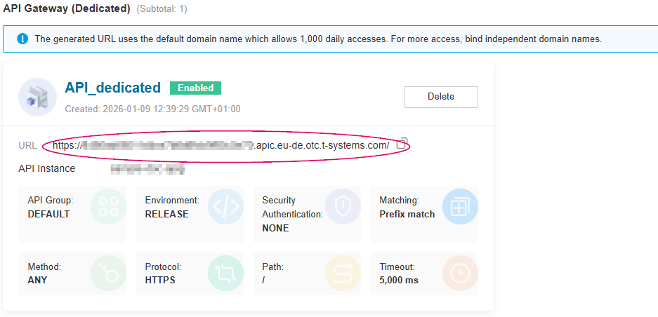
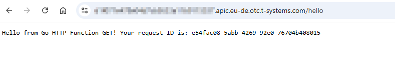

.. _creating_an_http_function_from_scratch:

Creating an HTTP Functions with Go from scratch
==========================================================================

.. toctree::
   :hidden:

Introduction
------------

For general details about creating HTTP functions from scratch and
execute an HTTP function,
see :otc_docs:`Creating a Function from Scratch and Executing the Function <function-graph/umn/getting_started/creating_a_function_from_scratch_and_executing_the_function.html>`
in the user manual.

This chapter describes how to create a FunctionGraph HTTP function using Go language
and perform local verification.

HTTP functions do not support direct code deployment using Go in web console.

This section uses binary conversion as an example to describe how to
deploy Go programs on FunctionGraph.

.. note::

  You need to implement an **HTTP server** in the image listening to port **8000** to receive requests.

  To initialize the function configuration, implement the **"init()"**
  function can be used, which Go will execute automatically.

Constraints and Limitations
---------------------------

Additional to the constraints mentioned in :ref:`general_constraints_go_http`,
following constraints apply when building Go HTTP functions from scratch:

* | The handler must be set in the **bootstrap** file.
  | The bootstrap file is the startup file of the HTTP function.
  | The HTTP function can only read bootstrap as the startup file name.
  | If the file name is not bootstrap, the service cannot be started.

bootstrap file
^^^^^^^^^^^^^^^^
The bootstrap file must be in the root directory of the deployment package.

Example of bootstrap file for project named **myHttpFunction**

.. code-block::
  :caption: bootstrap file

  /opt/function/code/myHttpFunction

Step 1: Create the Project
--------------------------------------------

This sample uses the `go-restful <https://github.com/emicklei/go-restful>`_
framework to implement the HTTP function.

Complete code for this sample can be found on Github: :github_repo_master:`samples-doc/scratch-http <samples-doc/scratch-http>`.

Create Go Module
^^^^^^^^^^^^^^^^^^^^^^^^^

**1. Create directories for your project and navigate to it**

.. code-block:: shell

   # create project directory and src subdirectory
   mkdir -p scratch-http/src
   # navigate to project directory
   cd scratch-http

**2. Initialize a Go module**

Run the following command to initialize a new Go module:

.. code-block:: shell

  go mod init scratch-http

**3. Add dependencies**

Run the following commands to add the necessary dependencies:

.. code-block:: shell

    # add go-restful framework
    go get -u github.com/emicklei/go-restful

**4. Resulting go.mod**

The resulting **go.mod** file should look like this:

.. literalinclude:: /../../samples-doc/scratch-http/go.mod
  :language: go
  :caption: :github_repo_master:`go.mod <samples-doc/scratch-http/go.mod>`
  :tab-width: 2

Implement the function
^^^^^^^^^^^^^^^^^^^^^^^^^^^^^^^^^^^^^^^^^^^^^^^^

Change folder to **src** folder:

.. code-block:: shell

   # navigate to src directory
   cd src

Create the source file **main.go**. The code is as follows:

.. literalinclude:: /../../samples-doc/scratch-http/src/main.go
    :language: go
    :caption: :github_repo_master:`main.go <samples-doc/scratch-http/src/main.go>`

Run and Test from source code
^^^^^^^^^^^^^^^^^^^^^^^^^^^^^^^^^^^^^^^^^^^^^^^^

To test the function from source code, execute in the **container-http/src** folder:

.. code-block:: shell

   go run .

The server starts listening on port 8000.

You can use curl to send a test request to the function using a new shell.

.. code-block:: shell

    curl -X POST -H 'Content-Type: application/json' \
      -d 'nice to meet you local' \
      http://localhost:8000/hello

The expected response is:

.. code-block:: text

   Hello from Go HTTP Function! Your request ID is:

Step 2: Compiling and packaging
--------------------------------------------

.. tabs::

   .. tab:: Linux

        To ease building and packaging, create a Makefile in the project root directory
        like the following:

        .. literalinclude:: /../../samples-doc/scratch-http/Makefile
            :language: Makefile
            :caption: :github_repo_master:`Makefile <samples-doc/scratch-http/Makefile>`

        The Makefile automates the build process for your Go FunctionGraph HTTP
        function.

        You can run the **make build** command in the project root directory
        to compile your function code and generate the executable file named
        **go-http-demo** in the **target** directory.

        The **make zip** command creates a deployment package named **deploy.zip**
        that contains the executable file and a **bootstrap** file.

        The **bootstrap** file is required by FunctionGraph to identify
        the entry file of the function.

        .. code-block::
          :caption: bootstrap file

          /opt/function/code/go-http-demo

   .. tab:: Windows

        To ease building and packaging, create a build.cmd file in the project root directory
        like the following:

        .. literalinclude:: /../../samples-doc/scratch-http/build.cmd
            :language: bat
            :caption: :github_repo_master:`build.cmd <samples-doc/scratch-http/build.cmd>`

        Run the **build.cmd** script in the project root directory to compile your function code
        and generate the executable file named **go-http-demo** and the **bootstrap** file in
        the **target_win** directory.

        The **bootstrap** file is required by FunctionGraph to identify
        the entry file of the function.

        .. code-block::
          :caption: bootstrap file

          /opt/function/code/go-http-demo

      The script also creates a deployment package named **go-http-demo.zip** in the project
      root directory using the Windows tar.exe command.

Step 3: Create FunctionGraph HTTP Function
----------------------------------------------------

1. In the left navigation pane of the management console, choose **Compute** > **FunctionGraph**.
   On the :fg_console:`FunctionGraph console <>`, choose **Functions** > **Function List** from the navigation pane.
2. Click **Create Function** in the upper right corner. On the displayed page, select **Create from scratch**
   for creation mode.
3. Set the basic function information.

   -  **Function Type**: Select **HTTP Function**.

   -  **Region**: The default value is used. You can select other regions.

      **Regions are geographic areas isolated from each other.
      Resources are region-specific and cannot be used across regions through internal network connections.
      For low network latency and quick resource access, select the nearest region.**

   -  **Function Name**: Enter e.g. **MyGoHttpFunction**.

   -  **Enterprise Project**: The default value is **default**. You can select the created enterprise project.

      Enterprise projects let you manage cloud resources and users by project.

   -  **Agency**: **None**

   -  **Runtime**: Select **Go 1.x**.

 4. Advanced Settings:

    -  **Collect Logs** is disabled by default. If it is enabled,
       function execution logs will be reported to Log Tank Service (LTS).
       You will be billed for log management on a pay-per-use basis.

        ..  list-table::
            :header-rows: 1
            :widths: 20 80

            * - Parameter
              - Description

            * - Log Configuration
              - You can select **Auto** or **Custom**.

                - **Auto**: Use the default log group and log stream.
                  Log groups prefixed with "functiongraph.log.group" are filtered out.
                - **Custom**: Select a custom log group and log stream.
                  Log streams that are in the same enterprise project as your function.

            * - Log Tag
              - | You can use these tags to filter function logs in LTS.
                | You can add 10 more tags.
                | Tag key/value: Enter a maximum of 64 characters.
                | Only digits, letters, underscores (_), and hyphens (-) are allowed.

 5. After the configuration is complete, click **Create Function**.

 6. After the function is created, deploy the function code
    by upload the **deploy.zip** if created on Linux
    or the **go-http-demo.zip** package if created on Windows
    using the **Upload Code** / **Upload local Zip** feature in the **Code Source** section.

For details, see :otc_fg_umn:`Creating an HTTP Function <building_functions/creating_a_function_from_scratch/creating_an_http_function.html#procedure>`

Step 4: Test using console
-----------------------------------------------------

To test using console you have to create a test event in the same structure as
an API Gateway would send the request to the function.

Create the test event using :fg_console:`FunctionGraph console <>`,
in Code section, select **Configure Test Event** and click **Test**.

In the displayed dialog box, create a test event:

- Select **API Gateway (Dedicated)** (only available option),
- set **Event Name** to **helloworld**,
- modify the test event as follows:

  .. literalinclude:: /../../samples-doc/scratch-http/resources/test_post_event.json
    :language: json
    :caption: :github_repo_master:`test_post_event.json <samples-doc/scratch-http/resources/test_post_event.json>`
    :tab-width: 2

  The preceding example test event simulates:

  - an HTTP **POST** request (Parameter **httpMethod**)
  - to the **/hello** API Endpoint of the HTTP function (Parameter **path**)
  - with the request body **bmljZSB0byBtZWV0IHlvdQ==**
    (Parameter **body**) as base64 encoding string *nice to meet you*
  - and base64 encoding indicator set to **true** (Parameter **isBase64Encoded**).

-  and click **Create**.

See also: :otc_docs:`Step 5: Test the Function <function-graph/umn/getting_started/creating_an_event_function_using_a_container_image_and_executing_the_function.html#step-5-test-the-function>`
in the user manual.

Step 5: View the Execution Result
---------------------------------

Click **Test** and view the **Execution Result** on the right.

The execution result contains the following sections:

* The **Function Output** section displays the function's return value.

  The response returned by FunctionGraph a Json object of Type **apig.APIGTriggerResponse**.

  .. code-block:: json

      {
          "body": "SGVsbG8gZnJvbSBHbyBIVFRQIEZ1bmN0aW9uISBZb3VyIHJlcXVlc3QgSUQgaXM6IDAxZTNhNGFkLWNlN2MtNDk1Ni1iMmVkLWM1YjQ0MGIyM2FjOQo=",
          "headers": {
              "Content-Length": [
                  "86"
              ],
              "Content-Type": [
                  "text/plain; charset=utf-8"
              ],
              "Date": [
                  "Tue, 03 Feb 2026 14:08:31 GMT"
              ]
          },
          "statusCode": 200,
          "isBase64Encoded": true
      }

  * The **body** field contains the Base64-encoded string of:

    ``Hello from Go HTTP Function! Your request ID is: 01e3a4ad-ce7c-4956-b2ed-c5b440b23ac0``.

  * The **statusCode** field indicates that the request is processed successfully and
  * **isBase64Encoded** indicates that the body is encoded using Base64.

* The **Log Output** section displays the logs generated during function execution.

  .. note:: This page displays a maximum of 2K logs.

* The **Summary** section displays key information from the **Log**.

.. _getting_apig_trigger_url_scratch:

Step 6: Creating an APIG (Dedicated) trigger
--------------------------------------------

Create an APIG (dedicated) trigger by referring to :otc_docs:`Step 7: Configure the trigger information <function-graph/umn/configuring_triggers/using_an_apig_dedicated_trigger.html#functiongraph-01-0204>`
in the user guide.

Set following parameters:

.. list-table::
    :header-rows: 1
    :widths: 20 80

    * - Parameter
      - Description

    * - Trigger Type
      - API Gateway (Dedicated)

    * - API instance
      - Create a new API instance or select an existing API instance.

    * - API Name
      - e.g. **MyGoHttpAPI**

    * - API Group
      - Create a new API group or select an existing API group.

    * - Environment
      - **RELEASE**

    * - Security Authentication
      - **None** for debugging

    * - Protocol
      - **HTTPS**

    * - Method
      - **ANY**

The ``API_GATEWAY_TRIGGER_URL`` is displayed after the trigger is created.

See the following figure:

Step 7: Test using APIG trigger
---------------------------------------------------------

Test using browser
^^^^^^^^^^^^^^^^^^^^^^^^^^^^^^^^^^^^^^^^^^^^^^^^

Copy the URL of the APIG trigger and add **/hello** to the address box of the browser.

This will test the HTTP function using an HTTP **GET** request.

The following information is displayed:

    Result in browser

Test using curl
^^^^^^^^^^^^^^^^^^^^^^^^^^^^^^^^^^^^^^^^^^^^^^^^

To test the function using curl and the HTTP **POST** method,
replace `${API_GATEWAY_TRIGGER_URL}` (see :ref:`getting_apig_trigger_url_scratch`) with the URL of your APIG trigger and
run the following command:

.. code-block:: shell

   curl -X POST -H 'Content-Type: application/json' \
     -d 'nice to meet you' \
     ${API_GATEWAY_TRIGGER_URL}/hello

The expected response is:

.. code-block:: text

   Hello from Go HTTP Function! Your request ID is: e0ccd18b-d365-4f31-a9de-3557ddbbeade

Deploy the HTTP Function using Terraform
---------------------------------------------------------------

For details on how to deploy using Terraform,
see :ref:`deploying_an_http_function_using_terraform`.
